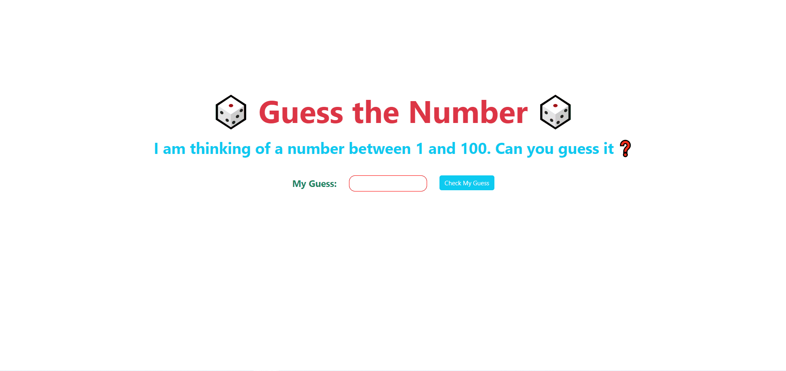

Clarusway

## Project-10 :Find the Number Game

## GO TO NETLIFY ➡ https://02google.netlify.app/

## Description

Project aims to create find the number game (between 0 to 100).

## Problem Statement

- Your company has recently started on a project that aims to create a find the number game. So you and your colleagues have started to work on the project.
- Each time the application is opened, it will keep a random number between 1-100 in the background.
- The user makes a guess.
- The number is compared and guided up/down until the user guess the correct number.
- For example:
  - Let your number be 65 and user guessed '20' the first time.
  - Prompt the user to "Enter a number between 20 and 100".
  - If the user guessed 80 on the second guess, this time you should prompt "Enter a number between 20 (the lowest guess closest to your number) to 80 (the closest big guess to your number)".

## Objective

Build a Find the Number Game (Between 0 to 100)

### At the end of the project, following topics are to be covered;

- HTML

- CSS

- JS

### At the end of the project, students will be able to;

- improve coding skills within HTML & CSS & JS

- use git commands (push, pull, commit, add etc.) and Github as Version Control System.
